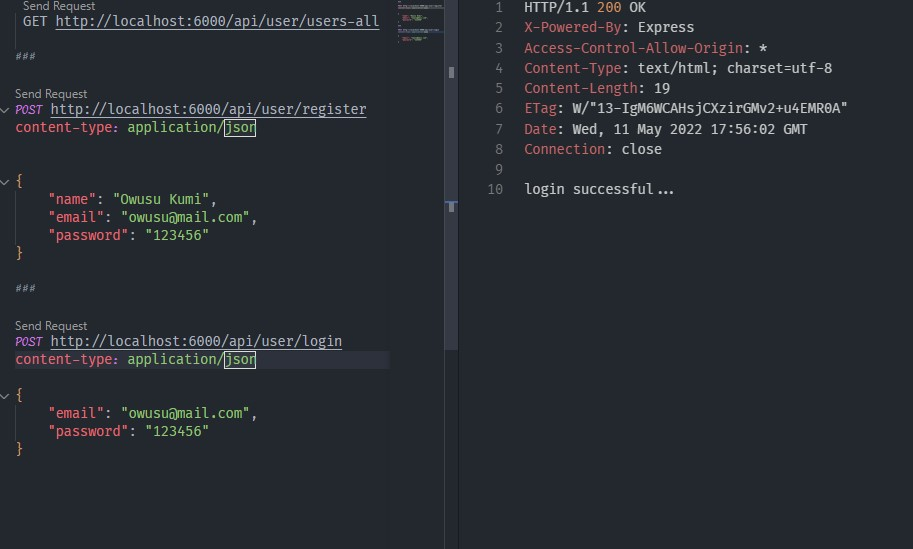

## rest api with mongo DB and JsonWebToken



- the screenshot is with Rest Client extention inside vs code editor

## installation

- clone repository
- cd into project
- run ``` npm install ``` Note: install 'nodemon' as a dev dependency
- add '.env' file and edit your db connection as DB_CONNECTION = value and TOKEN_SECRET = value
- start server with ``` npm start ```
